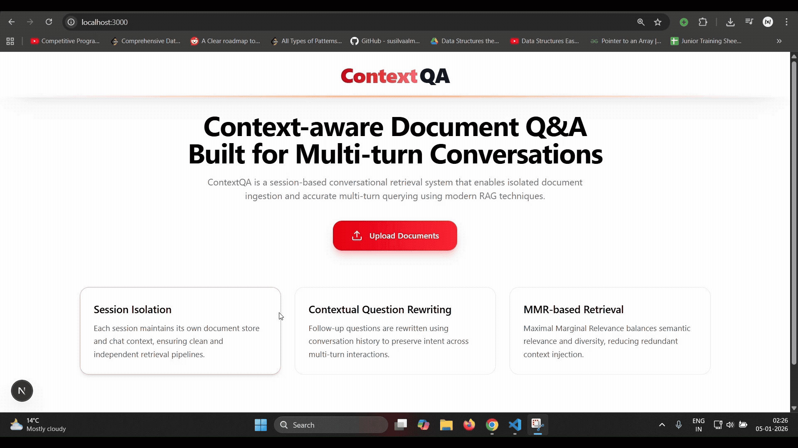

# ContextRAG
## Demo

   

## Details
- Built a session-based conversational RAG system using FastAPI, FAISS, and LangChain, enabling isolated document ingestion and querying per session.
- Implemented contextual question rewriting using chat history to improve retrieval accuracy for multi-turn conversations.
- Used MMR-based vector retrieval to balance relevance and diversity of document chunks, reducing redundant context.

- Tech Stack: Nextjs, FastAPI, FAISS, LangChain, GROQ API, HuggingFace

## Setup
### Frontend (Nextjs)
1. `cd frontend`
2. Install deps: `npm install`
3. Install deps: `npm install -D @types/node`
4. Run frontend server: `npm run dev`
- Open: http://localhost:3000

### Backend (FastAPI)
1. `cd rag-2`
2. Create venv: `uv venv && .venv\Scripts\activate`
3. Install deps: `uv pip install -r requirements.txt`
4. Run backend server `uvicorn main:app --reload --host 0.0.0.0 --port 8000`
- Default URL: http://localhost:8000
